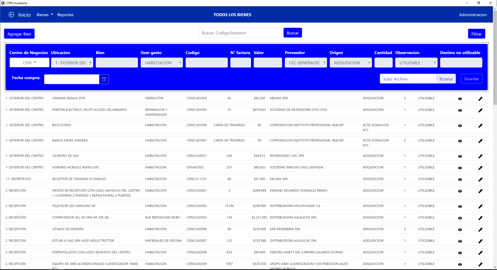
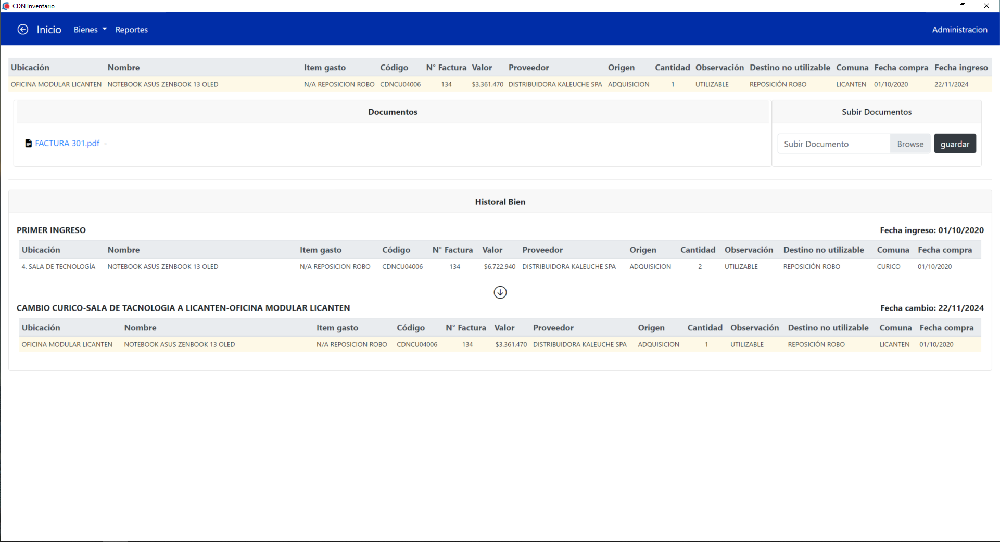
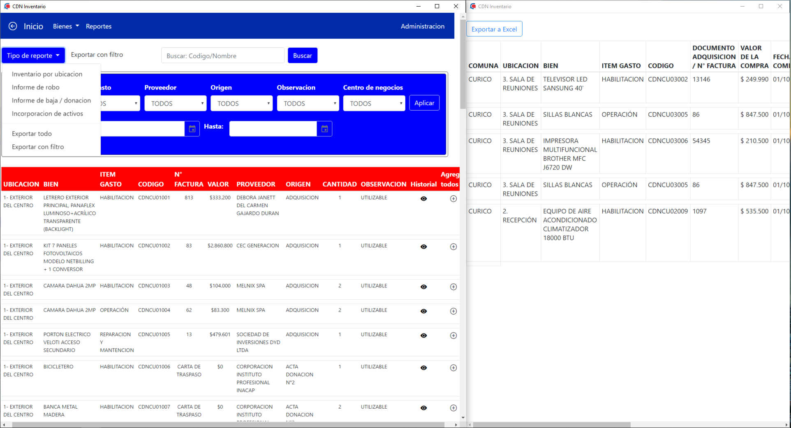

 Asset Tracking & Inventory Management System

Sistema de gestión y trazabilidad de inventario desarrollado para SERCOTEC Curicó, orientado al seguimiento histórico de activos, control de su ubicación en el tiempo, generar reportes y  exportar datos.

---

 Descripción

Este proyecto fue desarrollado durante una práctica profesional con el objetivo de resolver la falta de control sobre la ubicación y uso de activos dentro de la organización.

El sistema permite registrar y consultar la trazabilidad completa de cada activo, incluyendo sus cambios de ubicación y uso a lo largo del tiempo, además de generar reportes automáticos para facilitar la gestión.

---

 Problema que resuelve

Antes de este sistema:

- No existía registro histórico de los activos
- Se desconocía la ubicación anterior de los equipos
- No había control claro sobre el uso de los recursos
- La generación de reportes era manual o inexistente

Con este sistema:

- Se obtiene trazabilidad completa de cada activo
- Se registra cada cambio de ubicación
- Se mejora el control interno
- Se generan reportes automáticamente

---

 Funcionalidades principales

-  Sistema de autenticación (login)
-  Registro y gestión de activos
-  Seguimiento de trazabilidad
-  Historial de ubicaciones
-  Registro de movimientos
-  Generación de reportes
-  Exportación de datos
-  Consulta de información histórica

---

 Tecnologías utilizadas

- **Lenguaje**
  - PHP

- **Base de datos**
  - SQLite

- **Frontend**
  - Bootstrap

- **Entorno**
  - Aplicación de escritorio ejecutada en navegador (Chrome)

---

 Tipo de aplicación

Aplicación de escritorio basada en tecnologías web, ejecutada localmente mediante navegador.

---

Interfaz

El sistema cuenta con interfaz gráfica que permite:

- Gestión de activos
- Registro de movimientos
- Visualización de historial
- Generación de reportes

Screenshots

 Instalación y ejecución

bash
# Clonar repositorio
git clone https://github.com/FelipeOrmazabal/asset-traceability-system.git

# Acceder al proyecto
cd nombre-del-repo
